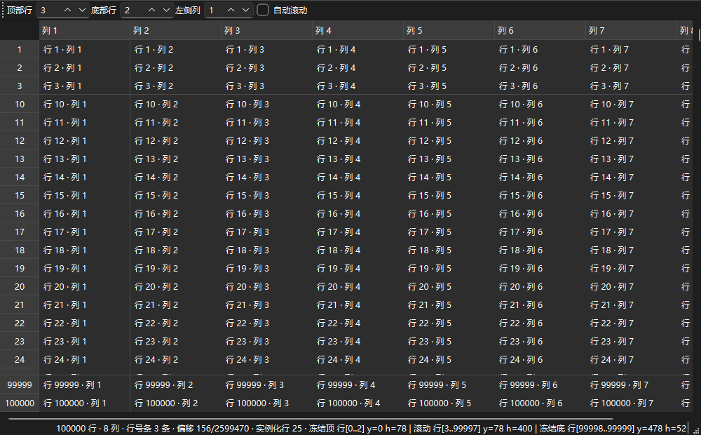
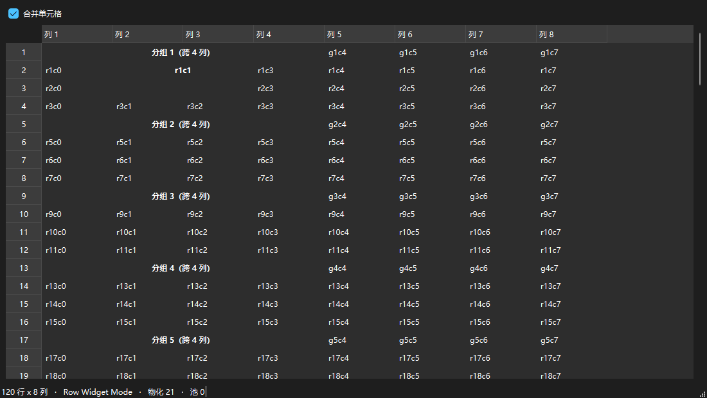
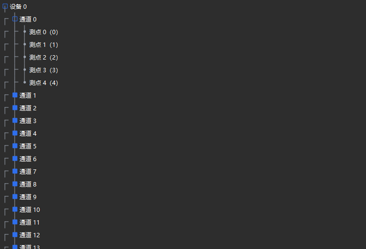
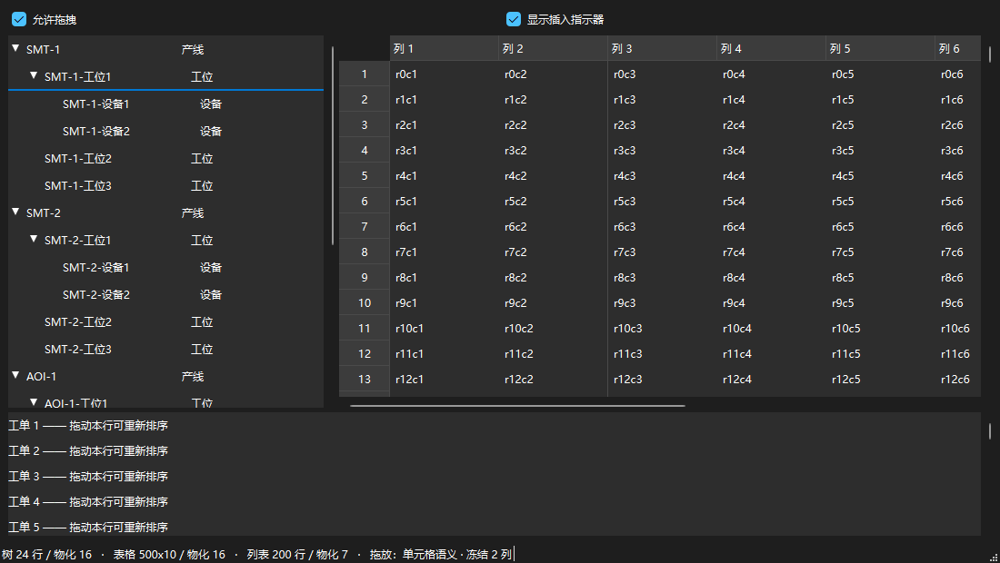

# VirtualItemViews

> **Qt Widgets 的虚拟化 Item View 框架**：用 `QAbstractItemModel` 做数据源，只实例化可见区、overscan 与 pinned 范围内的**真实 QWidget**，滚动时复用它们。

Virtualized QWidget item views for Qt Widgets — real widgets, but only where you can see them. C++17 · Qt 5.15 / Qt 6.2+ · static or shared.

[](LICENSE)
[](docs/abi.md)
[](CMakeLists.txt)
[](CHANGELOG.md)

它**不是** `QListView` 的替代品。它解决的是另一个工程折中：复杂业务行用 Delegate 绘制会带来大量
`paint`、`geometry`、`hit-test`、`editorEvent` 样板代码，而 `QListWidget + setItemWidget` 又会为
每一行创建真实控件。VirtualItemViews 提供第三条路：**只创建看得见的行，且这些行是真正的
QWidget**。

## 亮点

* **只创建看得见的行，而且它们是真控件** —— 行内的按钮、开关、进度条、编辑器、异步图片照常工作，
  不用写 `paint()` / `sizeHint()` / `hitTest()` / `editorEvent()` 那一套 Delegate 样板。
* **千万级逻辑行不虚**：1,000,000 行列表打开 15.8 ms、稳态滚动 0.89 ms/步、滚动期间 0 次
  new/delete；1,000,000 个同时可见行的树打开 4.2 s、展开一条 4 层深路径 174.9 ms 且只查模型 48 次。
  数字与命令见 [performance.md](docs/performance.md)。
* **动态高度**：估计值 + 测量反馈 + `ScrollAnchor`，异步改变行高不让视口跳动。
* **表格能干的活都干了**：冻结列（左/右）、冻结行（上/下）、span 合并、多滚动组（任意 pane 与
  滚动组）、表头动画与拖动换序、Row Widget / Cell Widget 两种物化模式；列几何只有一个事实来源
  （`HeaderGeometry`），没有第二份副本。
* **树**：可见行压平 + 同一个 list kernel；expand/collapse 是增量的（每个已展开父节点一棵
  Fenwick 前缀和），结构变更保留展开状态与滚动锚点。
* **交互**：拖放（视图管交互、模型管语义，树支持「成为子节点」）、像素滚动、触控板 `pixelDelta`
  1:1、焦点 / IME / popup pinning、`QSortFilterProxyModel` 直连。
* **可访问性**：`QAccessibleInterface` 桥接只暴露可见行（百万行模型仍是十几个节点），表格另有
  `QAccessibleTableInterface` / `QAccessibleTableCellInterface`。
* **工程化**：静态库与动态库都支持，装完就是标准 CMake 包（消费端一行 `find_package`）；公开 API
  按「应用 / 扩展 / 诊断 / 私有」四级冻结；`pwsh -File scripts/validate.ps1` 一条命令跑完四种组合
  共 28 步验证。

## 能力概览

| 区域 | 内容 |
| --- | --- |
| 内核 | `VirtualItemView`（基于 `QAbstractScrollArea`）、`WidgetAdapter` / `WidgetRecycler` 分池、`ScrollMapper`（64 位逻辑滚动空间）、`SizeIndex`（固定 / 动态，动态侧只存「与估计值不同」的行）、`LayoutPolicy` / `ListLayout` |
| 列表 | `VirtualListView`：固定高度 + 动态高度 + 异步测量 + 滚动锚点 |
| 表格 | `VirtualTableView`：`HeaderGeometry` 单一事实来源、Row Widget / Cell Widget 两种模式、列 resize / move / hide / 排序 / 状态持久化 |
| 冻结 | 冻结列（左/右）、冻结行（上/下）、显式 pane 列表与多滚动组、交界线样式 |
| 合并 | span（`TableSpanProvider` / `TableSpanMap`）：矩形完全由已提交几何推出，两种物化模式都支持 |
| 表头 | `NativeHeaderView`（QHeaderView 适配）、`VirtualHeaderView` + `HeaderWidgetAdapter`（每个可见 section 一个真控件）、换序动画 |
| 树 | `VirtualTreeView`：增量展开/折叠、缩进、分支指示与自定义渲染器、结构变更保状态 |
| 交互 | 拖放（含树「成为子节点」与边缘自动滚动）、选择模式、像素滚动、键盘导航、pin / IME / popup |
| 数据 | 任意 `QAbstractItemModel`（含 `QSortFilterProxyModel`）、完整模型信号矩阵 |
| 可访问性 | `installAccessibilityFactory()`、表格与单元格接口、焦点与动作 |
| 工程化 | 静态 + 动态库、安装包与消费端冒烟测试、API / ABI 文档、12 个示例、基准与一键验证 |
| 规模 | 十万到千万级逻辑行；实测基线见 [performance.md](docs/performance.md) |

逐项状态（60 余条，含落点语义、边界与对应示例）见 **[docs/features.md](docs/features.md)**。

## 界面预览

下面几张图是仓库里的示例程序自己导出的（`--snapshot`，无人值守可复现），不是手绘示意图；
重跑一遍就能得到同样的图：

| 冻结行 + 冻结列 + 行号条（`table_frozen_rows --snapshot`） | 合并单元格（`table_spans --snapshot`） |
| --- | --- |
|  |  |
| 树 + 自定义分支图标（`tree_view --custom-icons --snapshot`） | 拖放：三种落点语义（`drag_drop --hover tree:120 --snapshot`） |
|  |  |

## 定位与适用场景

适合：

* 行内包含真实控件（按钮、开关、进度条、编辑器、异步图片）的企业列表；
* 行高由业务内容决定、甚至会异步变化的长列表；
* 十万到千万级逻辑行，需要稳定内存与稳定滚动性能的场景。

不适合：

* 只需要纯绘制、追求极限吞吐的表格（请用 `QTableView` + `QStyledItemDelegate`）；
* 需要 GPU / scenegraph 渲染的场景（本库的绘制走 QPainter，与 `QWidget` 行同源）；
* 每行都是重型浏览器/视频控件、且要求十万级**同时可见**的场景（真控件始终有成本，
  虚拟化的收益来自"只看得到的那几十个"）。

## 快速开始

```cpp
#include <virtualitemviews/widgetadapter.h>
#include <virtualitemviews/virtuallistview.h>

class OrderAdapter : public viv::WidgetAdapter
{
public:
    QWidget *createWidget(viv::WidgetType, QWidget *parent) override
    {
        return new OrderCardWidget(parent);            // 行内真实业务控件
    }

    void bindWidget(QWidget *widget, const QModelIndex &index) override
    {
        static_cast<OrderCardWidget *>(widget)->bind(index);
    }

    void unbindWidget(QWidget *widget, const QModelIndex &index) override
    {
        static_cast<OrderCardWidget *>(widget)->stopAsyncWork(index);
    }

    QSize estimatedSize(const QModelIndex &) const override { return QSize(600, 96); }
};

OrderAdapter adapter;
QMainWindow window;
// 视图交给窗口持有：不要在栈上创建视图后再 setCentralWidget()，
// 否则窗口析构时会 delete 一个栈对象（退出时崩溃）。
auto *view = new viv::VirtualListView(&window);
view->setAdapter(&adapter);
view->setUniformItemHeight(96);       // 固定行高；动态行高见 setItemHeightMode(Variable)
view->setOverscan(2, 2);
view->setWheelScrollMode(viv::VirtualItemView::WheelScrollMode::Pixels);
view->setWheelScrollPixels(48);       // 一个滚轮刻度 48 px，与行高无关
view->setModel(model);                // 任意 QAbstractItemModel，含 QSortFilterProxyModel

connect(view, &viv::VirtualItemView::clicked, [](const QModelIndex &index) {
    // 行内 QPushButton 等控件仍然自己处理事件；空白区域点击会走到这里
});

view->scrollByPixels(24);             // 程序内同样按像素滚动
const viv::VirtualViewStats stats = view->stats();  // 诊断/debug overlay
// logicalItems / materializedItems / pooledWidgets / pinnedWidgets
// createCount / bindCount / recycleCount
```

完整的可运行示例在 `examples/`（全部为像素滚动；都支持 `--exit-after <ms>`，另有各自的规模与
滚动参数，如列表的 `--rows`、树的 `--devices`、统一的 `--wheel-pixels`，便于无人值守运行；
退出码 0 表示正常结束）；[tests/install/consumer](tests/install/consumer) 是最小的**完整工程**
（`CMakeLists.txt` + `main.cpp`），演示怎么从零把库用起来，见下文「安装与消费」：

表格（Row Widget Mode）：一行一个业务 QWidget，列由 `ColumnHost` 承载，
列几何全部来自 `HeaderGeometry`（表头与行共享同一份 committed geometry）：

```cpp
class OrderRowWidget : public QWidget
{
public:
    explicit OrderRowWidget(QWidget *parent = nullptr) : QWidget(parent)
    {
        m_order = new QLabel(new viv::ColumnHost(0, this));     // 框架负责定位
        m_status = new QLabel(new viv::ColumnHost(2, this));
    }
    // ...
};

auto *table = new viv::VirtualTableView(&window);
table->setTableAdapter(&adapter);              // TableWidgetAdapter（可选 layoutRowWidget()）
table->setUniformItemHeight(44);
table->setDefaultColumnWidth(150);
table->setSortingEnabled(true);
table->setModel(model);

table->setColumnHidden(1, true);               // 列状态只有一个写入口
table->moveColumn(2, 0);
const QByteArray state = table->saveHeaderState();
table->restoreHeaderState(state);

// Cell Widget Mode（可选）：每个可见 cell 一个 QWidget，二维虚拟化
table->setCellAdapter(&cellAdapter);
table->setMaterializationMode(viv::VirtualTableView::MaterializationMode::CellWidgets);
```

冻结列（§31）：冻结列固定在自己的 pane 里，不参与横向滚动；三个 pane 都从同一份
`HeaderGeometry` 派生，所以没有"冻结表头自己的列宽副本"，拖动列宽会同时影响所有 pane：

```cpp
table->setFrozenColumns({0, 1});        // 左侧冻结（顺序无关，按视觉顺序排列）
table->setFrozenRightColumns({N - 1});  // 右侧冻结，右对齐贴住视口右边
table->isColumnFrozen(0);               // 查询
const QVector<viv::TablePane> panes = table->panes();   // 三个 pane 的矩形与列集合
table->clearFrozenColumns();
```

pane 交界那条线（表头 + body 连成一条）可以自定义颜色 / 线宽 / 线型：

```cpp
viv::PaneSeparatorStyle separator;      // 默认：1px，颜色取"当前样式画列分隔线用的颜色"
separator.width = 3;                    // 像素；0 = 不画这条线
separator.color = QColor("#e05555");    // 不设置（invalid）就自动与列分隔线同色
separator.lineStyle = Qt::SolidLine;    // 也支持 DashLine / DotLine（虚线在以该宽度为界的带内居中）
table->setPaneSeparatorStyle(separator);
```

Row Widget Mode 下一行仍然只有一个业务控件（冻结列的 `ColumnHost` 被框架 `raise()` 到上层，
遮住滚到它下面的列）；Cell Widget Mode 下冻结 cell 在任何滚动位置都保持实例化。
`examples/table_many_columns` 勾选「冻结前 2 列」即可看到效果。

树（v0.6）：树是"可见行压平 + 同一个 list kernel"，业务只管提供标准的
`QAbstractItemModel` 树，展开状态、缩进、分支指示与键盘导航都由框架处理：

```cpp
auto *tree = new viv::VirtualTreeView(&window);
tree->setAdapter(&adapter);                 // 与 List 相同的 WidgetAdapter
tree->setUniformItemHeight(26);
tree->setIndentation(20);                   // 每层缩进像素
tree->setBranchIndicatorsVisible(true);     // 由视图绘制并可点击（行控件不受影响）
tree->setModel(&treeModel);

tree->expand(model.index(0, 0));            // 也可以双击 / 点分支指示 / Right 键
tree->setRootIndex(model.index(3, 0));      // 只看某一棵子树
const qsizetype visible = tree->visibleRowCount();
```

分支图标可以按状态自定义（不需要图片资源，也不解析样式表）。视图会把每个可见行的**每一格**交给
渲染器：`cellDepth == itemDepth` 的那一格就是行自己那格（带展开/收起图标），更浅的格子是祖先格，
可以画 `├ └ │` 这类连接线。状态字段与 `QTreeView::branch` 的伪状态一一对应：

| `BranchIndicatorState` | `QTreeView::branch` | 含义 |
| --- | --- | --- |
| `hasChildren` | `:has-children` | 该格对应的节点有子节点 |
| `hasSiblings` | `:has-siblings` | 同层下面还有兄弟节点（竖线要继续） |
| `adjoinsItem` | `:adjoins-item` | 这一格就是行自己那格（只有它带展开/收起图标） |
| `isExpanded` / `isOpen()` / `isClosed()` | `:open` / `:closed` | 展开状态（只对有子节点有意义） |
| `isLeaf()` | `:!has-children` | 叶子 |
| `cellDepth` / `itemDepth` | — | 格子的层级 / 行的深度 |

```cpp
class BranchGlyphRenderer : public viv::BranchIndicatorRenderer
{
public:
    // 简单情形：一个状态一个图标。返回空 QIcon 表示这格不画东西。
    QIcon branchIcon(const viv::BranchIndicatorState &state, const QModelIndex &) const override
    {
        if (!state.adjoinsItem || !state.hasChildren)
            return QIcon();                       // 祖先格 / 叶子交给下面继续画线
        return state.isExpanded ? m_openIcon : m_closedIcon;
    }

    // 复杂情形：直接画（连接线 + 图标），QTreeView::branch 的图片资源可以整段搬过来。
    void paintBranch(QPainter *painter, const viv::BranchIndicatorState &state,
                     const QModelIndex &, const QRect &cellRect) const override
    {
        if (!state.adjoinsItem) {                 // 祖先格：竖线 + 到下一层的横线
            const int cx = cellRect.center().x();
            painter->drawLine(cx, cellRect.top(), cx,
                              state.hasSiblings ? cellRect.bottom() : cellRect.center().y());
            painter->drawLine(cx, cellRect.center().y(), cellRect.right() - 2, cellRect.center().y());
            return;
        }
        viv::BranchIndicatorRenderer::paintBuiltinBranch(painter, state, cellRect);
    }
};

glyphRenderer;                                 // 生命周期由业务持有（takeOwnership = false）
tree->setBranchIndicatorRenderer(&glyphRenderer);
tree->setBranchIndicatorRenderer(nullptr);     // 回到内置三角箭头
```

`examples/tree_view` 勾选「自定义图标」就能看到这套渲染器（方块 = 有子节点、圆点 = 叶子、
连接线按 `hasSiblings` / `adjoinsItem` 变化）；`--custom-icons --snapshot <file.png>` 可直接导出
PNG，用于无人值守的视觉检查。

拖放（v0.7，§38）：视图负责交互，模型负责语义。视图侧只要打开开关并在模型里给出 flags；插入、
移动、拒绝全部写在模型里（`canDropMimeData()` / `dropMimeData()`），框架不替业务做决定：

```cpp
// 模型侧：可拖动 + 可接收，载荷自定义 MIME，落点语义自己实现
Qt::ItemFlags Model::flags(const QModelIndex &index) const
{
    return Qt::ItemIsEnabled | Qt::ItemIsSelectable
         | Qt::ItemIsDragEnabled | Qt::ItemIsDropEnabled;
}
Qt::DropActions Model::supportedDropActions() const { return Qt::MoveAction | Qt::CopyAction; }
QMimeData *Model::mimeData(const QModelIndexList &indexes) const { /* 打包载荷 */ }
bool Model::canDropMimeData(const QMimeData *data, Qt::DropAction action,
                           int row, int column, const QModelIndex &parent) const { /* 接不接受 */ }
bool Model::dropMimeData(const QMimeData *data, Qt::DropAction action,
                        int row, int column, const QModelIndex &parent) { /* 插入/移动/拒绝 */ }

// 视图侧：打开拖放（同时把视口设为接受拖放），其余交给框架
view->setDragEnabled(true);
view->setDropIndicatorShown(true);              // 2px 插入线 / 树的框选；false 只是不画
view->setDefaultDropAction(Qt::MoveAction);     // 列表拖动 = 移动
view->setDragDropActions(Qt::MoveAction | Qt::CopyAction);   // 可选：覆盖模型给的动作

const viv::VirtualItemView::DropTarget target = view->dropTargetAt(viewportPos);   // 诊断/自测
const QRect indicator = view->dropIndicatorRect(target);
connect(view, &viv::VirtualItemView::itemDropped,
        [](const QModelIndex &parent, int row, int column, Qt::DropAction action) { /* ... */ });
```

落点语义（详见 [docs/drag-and-drop.md](docs/drag-and-drop.md)）：列表按行的上/下半段插入；表格跟随
`SelectionBehavior`（`SelectRows` = 整行，`SelectItems` = 单元格，冻结列用 `columnAtViewportX()`
做 pane-aware 命中）；树的上/下 1/4 是"插到节点之间"，中间 1/2 是"成为该节点的子节点"
（`DropTarget::ontoItem`，用框选指示器表示，对应 `QTreeView` 的 `OnItem`），最后一行之下的空白区
追加到末尾。拖到视口上/下边缘会自动滚动，并按同一个视口位置重新解析目标。

```bash
cmake -S . -B cmake-build-debug -DCMAKE_PREFIX_PATH=<Qt6 路径>
cmake --build cmake-build-debug --config Debug
ctest --test-dir cmake-build-debug -C Debug --output-on-failure
cmake-build-debug/bin/simple_list        # 10 万行
cmake-build-debug/bin/order_cards        # 复杂业务卡片（动态高度）
cmake-build-debug/bin/dynamic_height     # 异步高度变化 + anchor
cmake-build-debug/bin/million_rows       # 100 万行，观察控件数是否稳定
cmake-build-debug/bin/table_row_widgets  # 表格 Row Widget Mode
cmake-build-debug/bin/table_many_columns # 表格 Cell Widget Mode + 百列横向虚拟化
cmake-build-debug/bin/tree_view          # 树：展开/折叠/缩进/分支指示
cmake-build-debug/bin/drag_drop          # 拖放：列表 / 树 / 表格（冻结列）三种落点语义
cmake-build-debug/bin/drag_drop --hover tree:120 --snapshot drop.png   # 合成悬停 + 截图
cmake-build-debug/bin/table_spans        # 合并单元格：跨列分组标题 + 跨行合并 + 冻结列对照
cmake-build-debug/bin/table_spans --cell-mode --snapshot spans.png     # 跨行合并由框架渲染
cmake-build-debug/bin/table_panes        # 多个 pane + 两个独立滚动组（工具栏是组 1 的滚动条）
cmake-build-debug/bin/table_panes --check                             # 自检：组 1 滚动不影响其它 pane
cmake-build-debug/bin/table_many_columns --frozen 2 --frozen-rows 2 --snapshot frozen.png  # 冻结列 + 冻结行（行号条按 pane 切分）
cmake-build-debug/bin/table_frozen_rows   # 行冻结：顶部 3 行 + 底部 2 行 + 左侧 1 列（可调）
cmake-build-debug/bin/table_frozen_rows --check                          # 自检：冻结行不动、滚动范围不变、行号贴合
cmake-build-debug/bin/table_custom_header --widget-header --sections 200   # Widget 表头：每可见列一个控件
cmake-build-debug/bin/table_custom_header --move-demo header.png         # 表头换序动画（途中截图，显式请求过渡）
cmake-build-debug/bin/table_custom_header --drag-demo drag.png           # 拖动列：预览途中截图（committed 几何未动）
cmake-build-debug/bin/bench_listview --rows 1000000 --steps 2000
cmake-build-debug/bin/bench_listview --table --table-columns 100
cmake-build-debug/bin/bench_listview --tree
```

可执行文件统一在 `<build>/bin`、库在 `<build>/lib`（静态与动态都一样），所以示例/测试/基准
不需要任何 PATH 技巧就能找到共享库 —— 原因与细节见 [docs/abi.md](docs/abi.md)。

## 安装与消费

装出来的包是标准的 CMake 包：消费端只需要 `find_package(VirtualItemViews)`，不需要知道源码树
或构建树，也不用自己 `find_package(Qt6)`（Config 会用 `find_dependency()` 找回同一个 Qt）。

```bash
# 1) 构建并安装（静态或动态都行，默认静态）
cmake -S . -B build -G Ninja -DCMAKE_BUILD_TYPE=Release \
      -DCMAKE_PREFIX_PATH=D:/devlib/Qt/6.11.2/msvc2022_64
cmake --build build
cmake --install build --prefix D:/viv        # 头文件 + 库 + CMake package

# 2) 消费端 CMakeLists（完整可跑的版本在 tests/install/consumer/）
#    find_package(VirtualItemViews REQUIRED)
#    target_link_libraries(app PRIVATE VirtualItemViews::VirtualItemViews)
cmake -S tests/install/consumer -B consumer-build -G Ninja \
      -DCMAKE_PREFIX_PATH="D:/viv;D:/devlib/Qt/6.11.2/msvc2022_64"
cmake --build consumer-build
consumer-build/viv_consumer                   # 自检：list/table/tree/span/冻结列/accessibility
```

* `CMAKE_PREFIX_PATH` 要把**安装前缀**和 **Qt kit** 两个都写上：安装前缀里是本库，Qt 由 Config 的
  `find_dependency()` 去找。
* 消费的是**动态**安装（`-DVIRTUALITEMVIEWS_BUILD_SHARED=ON`）时，`VirtualItemViews.dll` 在
  `<prefix>/bin`：Windows 上把它放到 exe 同目录或加进 `PATH` 即可（上面自检脚本就是这么跑的）。
  静态安装没有这一步。
* 安装前缀是**按 Qt 大版本**区分的（Config 里写死了 `find_dependency(Qt6 …)` 或 Qt5），
  Qt 5 与 Qt 6 各装各的前缀。
* `tests/install/consumer` 是我们的冒烟测试：它只认 `find_package`，跑完 28 项自检（列表虚拟化、
  表格几何/状态/span/冻结列与显式 pane、树展开折叠、accessibility 工厂），退出码 0 才算通过。
  Qt 5.15.2 / Qt 6.11.2 × 静态 / 动态四种组合都已实跑通过。

## 构建

* C++17，CMake 3.16+，**Qt 6.2+ 或 Qt 5.15+**（Core/Gui/Widgets；测试需要对应版本的 Qt::Test）。
  配置时给出 Qt kit 即可，无需改动工程：

```bash
# Qt 6
cmake -S . -B cmake-build-debug-qt6  -G Ninja -DCMAKE_BUILD_TYPE=Debug \
      -DCMAKE_PREFIX_PATH=D:/devlib/Qt/6.11.2/msvc2022_64
# Qt 5
cmake -S . -B cmake-build-debug-qt5  -G Ninja -DCMAKE_BUILD_TYPE=Debug \
      -DCMAKE_PREFIX_PATH=D:/devlib/Qt/5.15.2/msvc2019_64
```

* 选项：`VIRTUALITEMVIEWS_BUILD_SHARED`、`VIRTUALITEMVIEWS_BUILD_TESTS`、
  `VIRTUALITEMVIEWS_BUILD_EXAMPLES`、`VIRTUALITEMVIEWS_BUILD_BENCHMARKS`、
  `VIRTUALITEMVIEWS_BUILD_GUI_TESTS`。
* **静态库（默认）与动态库都支持**：`-DVIRTUALITEMVIEWS_BUILD_SHARED=ON` 即构建
  `VirtualItemViews.dll` + 导入库；符号可见性由 `include/virtualitemviews/global.h` 的
  `VIRTUALITEMVIEWS_EXPORT` 决定，宏由 CMake 目标自动传播，业务代码不需要手工 define。
  版本号/SOVERSION 规则、什么改动算 ABI 破坏、Qt 与编译器支持矩阵见 [docs/abi.md](docs/abi.md)。
* 安装：`cmake --install` 会导出 `VirtualItemViews::VirtualItemViews` 目标与头文件
  （`include/virtualitemviews/**`）。

## Qt 5 / Qt 6 兼容约定

CMake 用 `find_package(QT NAMES Qt6 Qt5 …)` 选择版本（Qt5Config 不定义 `QT_VERSION_MAJOR`，
因此从 `Qt6::Core` / `Qt5::Core` target 推断），之后统一链接 `Qt${QT_VERSION_MAJOR}::*`。
代码层面的差异只有三处，都集中在头文件注释里说明：

| 差异 | 处理方式 |
| --- | --- |
| Qt 5 的 `QList` 没有 `QVector` 的 API（`resize/fill/remove(n)/insert(n)`、按长度构造） | 需要这些操作的可变长数组统一使用 `QVector<T>`（Qt 6 中 `QVector` 就是 `QList`），例如 `BlockSizeIndex` 的例外表和块列表、`TreeVisibilityIndex` 的可见行列表 |
| `QAbstractItemModel::dataChanged()` 的 roles 参数在 Qt 5 是 `QVector<int>`、Qt 6 是 `QList<int>` | 槽函数统一声明为 `QVector<int>`（Qt 6 中两者同一类型） |
| `QMouseEvent::position()` 只存在于 Qt 6 | 内部用 `QT_VERSION_CHECK(6,0,0)` 分支到 `QMouseEvent::pos()` |

同一份代码已在 Qt 6.11.2 / msvc2022_64 与 Qt 5.15.2 / msvc2019_64 两套配置下编译并跑通全部测试。

## 验证

* **一条命令跑完全部验证**（项目自带脚本，不是只在本机可用的临时命令）：

```bash
pwsh -File scripts/validate.ps1                       # Qt6 + Qt5 x 静态 + 动态
pwsh -File scripts/validate.ps1 -Library Static       # 只跑静态
pwsh -File scripts/validate.ps1 -SkipBenchmarks -SkipExamples
```

  脚本对每个组合依次做：configure → `all` 构建 → CTest → 12 个示例（`--exit-after`，退出码必须 0）
  → benchmark 不变量自检 → `cmake --install` + [tests/install/consumer](tests/install/consumer)
  消费端冒烟测试。Qt 路径默认取方案文档记录的本机 kit，可用 `-QtBin`/`-Vcvars`/`-CMake` 覆盖；
  最后按失败步数返回退出码（0 = 全绿）。
* 单元测试 / 变异测试 / GUI 交互测试都注册进 CTest（固定 `QT_QPA_PLATFORM=offscreen`）：
  `ctest --test-dir <build> -C Debug --output-on-failure`。
* **跑测试/示例/基准前必须把 Qt 的 `bin` 放进 `PATH`**（或用导入 MSVC + Qt 环境的验证脚本）：
  否则测试会以"找不到 Qt6Core.dll/Qt5Core.dll"之类的缺 DLL 错误失败，看起来像大面积用例失败。
  例如 `set PATH=D:\devlib\Qt\6.11.2\msvc2022_64\bin;%PATH%` 后再运行；
  `cmake --build` 自身不需要（构建系统用的是导入库）。
  本库自己的共享库**不需要** PATH：它和可执行文件一起放在 `<build>/bin`（见 [docs/abi.md](docs/abi.md)）。
* 示例与基准程序都可无人值守运行：示例传 `--exit-after <ms>` 时会在退出前打印一行统计
  （可见行 / 实例化 / 累计创建），退出码 0 表示正常结束；基准程序在违反虚拟化不变量时返回非 0。
* Debug 构建里 Qt 的 `Q_ASSERT` 失败在 MSVC 上会弹出模态对话框，headless 运行时表现为
  "程序不动、CPU 为 0"。排查疑似卡住时先按"断言失败"看（最常见来源是模型不满足
  `QAbstractItemModel` 契约，例如 `rowCount()` 对无效 parent 返回了 0），不要先怀疑滚动/回收路径。

## 文档

* [docs/architecture.md](docs/architecture.md)：分层、核心不变量、一次 materialization pass 的细节
* [docs/lifecycle.md](docs/lifecycle.md)：控件生命周期状态机、适配器契约、pin 规则
* [docs/model-signals.md](docs/model-signals.md)：模型信号处理矩阵与设计要点
* [docs/focus-ime.md](docs/focus-ime.md)：焦点 / IME / popup pin 规则、诊断与 pin 上限
* [docs/table-layout.md](docs/table-layout.md)：Table 阶段约束（HeaderGeometry 单一事实来源）
* [docs/drag-and-drop.md](docs/drag-and-drop.md)：拖放契约（视图侧交互 vs 模型侧语义、三种落点语义）
* [docs/accessibility.md](docs/accessibility.md)：辅助功能桥接（虚拟节点、可见行、树层次与行列语义）
* [docs/spans.md](docs/spans.md)：span 与 advanced panes 的规格（语义、实现状态、多滚动组细节）
* [docs/performance.md](docs/performance.md)：复杂度、规模特性、基准使用与已知取舍
* [docs/header-animation.md](docs/header-animation.md)：表头动画契约（committed/visual 两层几何、同步矩阵、渲染器支持）
* [docs/row-freezing.md](docs/row-freezing.md)：行冻结规格（§31 行方向类比：不变量、API、布局与滚动、实现顺序）
* [docs/api-stability.md](docs/api-stability.md)：公开 API 的四级分类（应用/扩展/诊断/私有）、冻结规则与 v1.0 复核清单
* [docs/abi.md](docs/abi.md)：版本号与 SOVERSION 规则、静态/动态构建、什么算 ABI 破坏、Qt 与编译器支持矩阵
* [docs/features.md](docs/features.md)：完整能力清单与状态（README 首页只放概览）
* [CHANGELOG.md](CHANGELOG.md)：版本变更（破坏性变更单独列出）
* [docs/roadmap.md](docs/roadmap.md)：进度与路线图（已完成 / 待做 / 每步完成定义 / 决策记录）

## 目录结构

```
include/
  virtualitemviews/          公共头：virtualitemview.h  virtuallistview.h  virtualtableview.h
                             virtualtreeview.h
                             headergeometry.h  nativeheaderview.h  tablewidgetadapter.h
                             widgetadapter.h  widgetrecycler.h  sizeindex.h  scrollmapper.h
                             listlayout.h  layoutpolicy.h  materializeditem.h
                             treevisibilityindex.h  types.h  accessibility.h
                             tablepane.h  tablespan.h  headerwidgetadapter.h
                             virtualheaderview.h  itempane.h  branchindicator.h
src/
  core/       scrollmapper.cpp  virtualitemview.cpp
  index/      sizeindex.cpp (FixedSizeIndex / BlockSizeIndex)  treevisibilityindex.cpp
  layout/     headergeometry.cpp  listlayout.cpp  tablepane.cpp  tablespan.cpp
  recycler/   widgetrecycler.cpp
  widgets/    accessibility.cpp  branchindicator.cpp  columnhost.cpp  nativeheaderview.cpp
              virtualheaderview.cpp  virtuallistview.cpp  virtualtableview.cpp
              virtualtreeview.cpp
tests/
  unit/       sizeindex / scrollmapper / widgetrecycler / listlayout / headergeometry /
              treevisibilityindex / 内核 / ListView / TableView / TableCellMode / TreeView /
              VirtualHeaderView / DragDrop / Accessibility / TableSpan / TablePanes / FrozenRows
  fuzz/       随机 insert/remove/move/dataChanged/reset
  gui/        List：鼠标/键盘/焦点 pinning/滚动数据新鲜度；Table：表头排序/横向滚轮/拖动列宽
  install/    消费端冒烟测试（独立工程：只 find_package 安装好的包）
scripts/      validate.ps1：一键验证（四种组合的构建/CTest/示例/基准/安装+消费端）
benchmarks/   1M 行与稳态滚动零分配校验（可选 QListView/QListWidget 参考）
              --table：row/cell 模式对照   --tree：宽树 + 结构变更 + 锚点
examples/     simple_list / order_cards / dynamic_height / million_rows
              table_row_widgets / table_many_columns / table_custom_header / tree_view / drag_drop
              table_spans / table_panes / table_frozen_rows
docs/         architecture.md  lifecycle.md  model-signals.md  focus-ime.md
              table-layout.md  drag-and-drop.md  accessibility.md  spans.md
              performance.md  header-animation.md  row-freezing.md  api-stability.md
              abi.md  features.md  roadmap.md
              images/     README 里的示例截图（由 examples 的 --snapshot 导出）
```

公共头以 `include/` 为根（例如 `#include <virtualitemviews/virtuallistview.h>`），安装后会放到
`include/virtualitemviews/`。

## 已知限制

* accessibility 还没有文本/编辑接口（`TextInterface` / `EditableTextInterface`；行内编辑器是真实
  控件，会自己暴露）。
* 树的**结构变更**（insert/remove/move/reset）仍然整体重建可见行列表（O(可见行)），见
  [performance.md](docs/performance.md) §4。
* 未实测的组合：GCC / Clang / Linux、Qt 6.2–6.10 的中间版本、`/MT` 运行库；Release 构建的性能
  基线也未采集（[abi.md](docs/abi.md) §5 列出了已实测与未实测）。
* 完整清单（含设计取舍）见 [docs/features.md](docs/features.md) 与 [docs/roadmap.md](docs/roadmap.md)。

## 命名与许可证

* 命名空间 `viv`，公开类不使用 Qt 保留风格的 `Q` 前缀（例如 `VirtualListView`），v0.1 前冻结。
* MIT，见 [LICENSE](LICENSE)。
